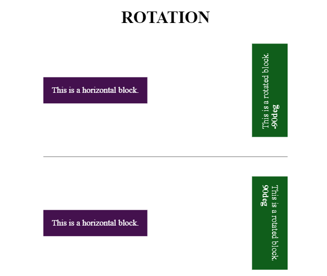

# Rotate your HTML blocks vertically


## Documentation: https://antonbobrov.github.io/rotate-html/


## How to start with NPM
```sh
npm install rotate-html
```

## How to start with CDN
```html
<script src="https://cdn.jsdelivr.net/npm/rotate-html/dist/cdn/index.min.js"></script>
```


## Example
```html
<div id="rotate-html">This is a template node element.</div>
```
```js
import rotateHtml from 'rotate-html';
```
```js
rotateHtml({
    selector: '#rotate-html'
});
```




## Settings

Option | Type | Default | Description
------ | ---- | ------- | -----------
selector | string\|HTMLElement | #html-rotate | The selector of the element.
rotate | 90\|-90 | -90 | Rotation angle.
updateOnResize | boolean| true | If you need to update the sizes of the element on resize.